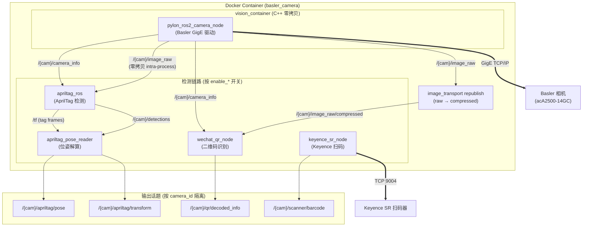

# ROS2 Basler Camera + QR Detector + AprilTag Detector + Keyence Detector Workspace

这是一个基于 ROS 2 Humble 的工业视觉工作区，当前生产基线为统一容器运行模式。

## 当前项目状况（2026-08-20）

- 标准运行模式：单容器 `basler_camera` 统一运行 Basler 相机、AprilTag、二维码和 Keyence 扫码链路。
- 统一启动入口：`industrial_vision_bringup/vision_pipeline.launch.py`。
- 部署形态：`deploy/basler_camera/docker-compose.yml` 使用 `network_mode: host`，默认镜像 `basler_camera_20260819_v2.0`。
- 当前相机基线：`startup_user_set=Default`，`binning 2x2`，图像规格 `Mono8 1294x970`。
- 关键输出接口（以 `camera_id=my_camera` 为例，所有输出按相机命名空间隔离）：
  - `/{camera_id}/qr/decoded_info`（二维码识别结果）
  - `/{camera_id}/apriltag/pose`、`/{camera_id}/apriltag/transform`（AprilTag 位姿/变换）
  - `/{camera_id}/scanner/barcode`（Keyence 扫码结果）
- 多相机支持：设置 `CAMERA_ID_2` 环境变量即可在同一容器内启动第二条独立 pipeline，每台相机可配置不同检测链路（`ENABLE_APRILTAG`/`ENABLE_QRCODE`/`ENABLE_KEYENCE`）。
- 容器健康判据：以 `/{CAMERA_ID}/pylon_ros2_camera_node/camera_info` 的类型与消息可达为准（healthcheck 已落地）。
- 验收口径：统一容器主流程以 `/{camera_id}/detections`、`/{camera_id}/apriltag/pose`、`/{camera_id}/qr/decoded_info` 可用为通过标准。
- 兼容说明：统一容器模式为唯一生产路径，各模块独立容器配置保留但不再主动维护。

详见：
- `项目启动运行指南/工控机ROS2集成与调用超详细指南.md`
- `handover_ros2_integration_2026-08-07/00-交接总览.md`
- `handover_ros2_integration_2026-08-07/02-启动与运行SOP.md`
- `handover_ros2_integration_2026-08-07/03-测试方法与验收标准.md`

## 目录说明

- `src/pylon_ros2_camera_component`: Basler pylon 相机核心组件
- `src/pylon_ros2_camera_wrapper`: 相机 ROS2 包装与 launch/config
- `src/qrcode_detector`: 二维码检测节点与模型
- `src/apriltag_pose_reader`: AprilTag TF/姿态读取封装与 launch
- `scripts`: 部署、迁移、RViz 启动等脚本
- `handover_ros2_integration_2026-08-07`: 中文交接与运行 SOP

## 系统架构



### 多相机拓扑

```mermaid
graph LR
    subgraph Container ["单容器"]
        P1["Pipeline 1<br/>camera_id=cam1<br/>QR only"]
        P2["Pipeline 2<br/>camera_id=cam2<br/>AprilTag only"]
    end

    CAM1["Basler #1"] --> P1
    CAM2["Basler #2"] --> P2
    KEY1["Keyence #1"] --> P1

    P1 --> "/cam1/qr/decoded_info"
    P2 --> "/cam2/apriltag/pose"
```

## 环境要求

- Ubuntu 22.04 LTS (x86_64)
- ROS 2 Humble
- Basler pylon SDK 8.0.0
- Python 3.10
- NumPy 1.26.4
- opencv-contrib-python-headless 4.8.1.78

新 PC 首次部署请执行：

先按 ROS 官方文档配置 Humble apt 软件源，然后运行：

```bash
cd /home/ubuntu/ros2_ws
bash install_dependencies.sh
```

完整软件表、手工安装步骤和验收标准见
`handover_ros2_integration_2026-08-07/06-组件与依赖安装详单.md`。

## 快速启动

每个终端先执行：

```bash
cd /home/ubuntu/ros2_ws
source /opt/ros/humble/setup.bash
source install/setup.bash
```

### 1. 启动相机

```bash
ros2 launch pylon_ros2_camera_wrapper pylon_ros2_camera.launch.py \
  config_file:=/home/ubuntu/ros2_ws/src/pylon_ros2_camera_wrapper/config/aca2500_106611_18.tuned_v3.yaml
```

### 2. 启动二维码节点

```bash
ros2 launch qrcode_detector qrcode_detector.launch.py
```

也可以使用一键脚本（仅相机 + 二维码）：

```bash
# 默认复用已有相机节点
./scripts/deploy_and_run_camera_qr.sh

# 先自动停掉旧相机，再拉起新相机和二维码节点
CAMERA_MODE=restart ./scripts/deploy_and_run_camera_qr.sh
```

### 3. 启动 AprilTag 姿态读取

```bash
ros2 launch apriltag_pose_reader apriltag_pose_reader.launch.py
```

也可以使用一键脚本（仅相机 + AprilTag）：

```bash
# 默认复用已有相机节点
./scripts/deploy_and_run_camera_apriltag.sh

# 先自动停掉旧相机，再拉起新相机和 AprilTag
CAMERA_MODE=restart ./scripts/deploy_and_run_camera_apriltag.sh
```

默认会同时启动官方 `apriltag_ros` 检测节点，并把 TF 里的 AprilTag 姿态转成：

- `/apriltag/pose`，类型为 `geometry_msgs/msg/PoseStamped`
- `/apriltag/transform`，类型为 `geometry_msgs/msg/TransformStamped`

如果你已经单独启动了官方 AprilTag 检测节点，可以把 `start_detector:=false`，只保留姿态读取器。

如果日志出现 "The camera is not calibrated"，可执行一键标定并自动落盘：

```bash
./scripts/calibrate_basler_camera_and_apply.sh
```

### 4. 验证链路

```bash
ros2 node list
ros2 topic info -v /my_camera/pylon_ros2_camera_node/image_raw
ros2 topic echo /wechat_qr_node/decoded_info --once
ros2 topic echo /apriltag/pose --once
```

### 5. 打开 RViz 查看图像

```bash
/home/ubuntu/ros2_ws/scripts/open_camera_rviz.sh
```

## 文档入口

- 工控机集成与调用超详细指南：`项目启动运行指南/工控机ROS2集成与调用超详细指南.md`
- 中文启动 SOP：`handover_ros2_integration_2026-08-07/02-启动与运行SOP.md`
- 新 PC 依赖安装：`handover_ros2_integration_2026-08-07/06-组件与依赖安装详单.md`
- Basler 安装说明：`BASLER_INSTALL_GUIDE.md`

## GitHub 仓库

当前工作区已同步到两个远程仓库：

- 个人仓库：`origin` -> https://github.com/jason889977/ros2_ws
- 组织仓库：`org` -> https://github.com/industrialnext-ai-dd/ros2_ws

查看远程：

```bash
git remote -v
```

常规提交流程：

```bash
git add .
git commit -m "your message"
git push
```

同时同步个人仓库与组织仓库：

```bash
git sync-all
```

如果只想单独推送组织仓库：

```bash
git push org main
```

## 备注

- `build/`、`install/`、`log/` 已通过 `.gitignore` 忽略，不会提交到 GitHub。
- `main` 当前默认跟踪个人仓库 `origin/main`。