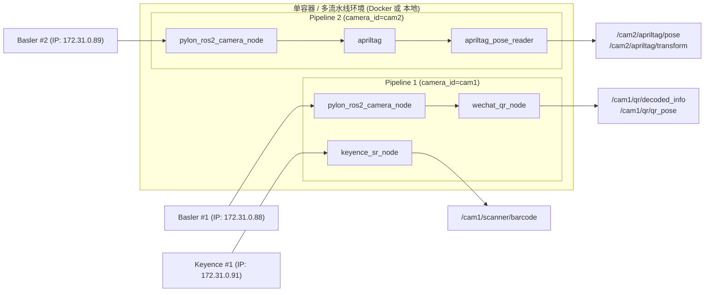

# ROS 2 工业视觉工作区

基于 ROS 2 Humble 的工业级视觉系统，集成 Basler GigE / USB 相机图像采集、AprilTag 6D 位姿检测、WeChatQR 深度学习二维码识别与 Keyence 工业扫码器，支持单相机与双相机独立流水线的高性能容器化与本地化部署。

---

## 核心特性

- **全链路组件化与进程内零拷贝 (Zero-Copy Intra-Process)**：
  - 相机驱动节点（`pylon_ros2_camera::PylonROS2CameraNode`）、AprilTag 识别节点（`apriltag_ros::AprilTagNode`）与二维码检测节点（`qrcode_detector::QRCodeNode`）均以 C++ Component 形式加载至多线程组件容器 `vision_container_<camera_id>`（`rclcpp_components/component_container_mt`）中。
  - 容器内部启用 `use_intra_process_comms: true`，图像数据在内存中以指针形式直接传递，避免 IPC 序列化与内存拷贝开销。
  - 辅助协同节点（`apriltag_pose_reader` 位姿转发、`keyence_sr_node` 扫码通信与 `vision_status_aggregator` 状态聚合）作为独立进程运行。全模块启用时，每路流水线包含 6 个运行节点（3 个 Composable Component + 3 个 Standalone Node）。
- **模块化检测流水线**：
  - AprilTag、二维码和 Keyence 模块均支持通过 Launch 参数（`enable_apriltag` / `enable_qrcode` / `enable_keyence`）独立启用或禁用，按需分配计算资源。
- **多相机命名空间隔离**：
  - 支持在单个进程容器或单 Docker 容器中并行运行多条独立 Pipeline。
  - 话题与服务均挂载于 `/{camera_id}/` 命名空间下。
  - AprilTag TF 坐标系按相机自动隔离（例如 `cam1/tag36h11:3` 与 `cam2/tag36h11:3`），避免多相机 TF 树冲突。
- **高性能采集与处理优化**：
  - **BEST_EFFORT 图像传输**：图像发布与订阅均采用 `BEST_EFFORT` 策略并限制队列深度为 1（`depth=1`），在处理端瞬时负载高时直接丢弃过期帧，保障实时性并杜绝采集循环阻塞。
  - **GenICam 1Hz 读取节流**：`publishCurrentParams` 从每帧读取 GenICam 寄存器节流至最高 1Hz；Chunk Mode 与时间戳寄存器状态在初始化时缓存。
  - **12-bit 转换内存复用**：`shift_buffer_` 作为类成员缓冲区复用，消除 12-bit 图像转换每帧的高频动态堆内存分配。
  - **编码映射缓存**：`currentROSEncoding` 在初始化时计算并缓存，仅在编码设置服务回调触发时更新，避免每帧高频查询 GenICam 字符串。
  - **二维码帧率门控与去重抑制**：内置 `min_detect_interval_s`（默认 $0.2\text{ s}$，限制检测最高约 $5\text{ Hz}$）与 `deduplicate_window_s`（默认 $0.5\text{ s}$ 抑制重复字符串发布）；优先采用 WeChatQR Caffe 深度学习模型，模型不可用时自动无缝降级至 OpenCV 原生二维码检测器。
  - **二维码 6D 位姿解算 (solvePnP)**：当相机具备有效内参标定（$f_x, f_y > 1.0$）且识别到有效角点时，基于 `qr_size_m`（默认 $0.10\text{ m}$）自动解算平面二维码在相机坐标系下的 6D 位姿并发布至 `/{camera_id}/qr/qr_pose`。
- **工业级稳定性与自愈保障**：
  - **Keyence TCP 长连接与保活**：TCP Socket 具备连接超时检测（$3\text{ s}$）、`SO_KEEPALIVE` 保活、`threading.RLock` 线程安全锁与自动定时重连（`reconnect_interval_s`）。
  - **节点崩溃自愈**：Launch 中对关键节点配置 `respawn=True` 与 `respawn_delay=3.0`，崩溃后自动按延迟重启且防重启风暴。
  - **空指针与异常安全保护**：相机节点所有服务回调、Pylon 操作与 Action 执行线程均包含指针有效性防护，避免重连及析构期间发生段错误。
  - **综合状态监控与健康检查**：`vision_status_aggregator` 聚合各模块 `/{camera_id}/diagnostics` 数据并发布 `/{camera_id}/vision/status` 综合状态；Docker 生产容器提供健康检查探针与冒烟测试脚本。

---

## 目录结构

```
src/
├── pylon_ros2_camera_interfaces/   # 自定义 ROS 2 消息 (msg)、服务 (srv) 与动作 (action) 定义
├── pylon_ros2_camera_component/    # Basler Pylon 相机核心驱动组件 (C++ Composable Component)
├── pylon_ros2_camera_wrapper/      # 相机启动包装、独立 Launch 与默认 YAML / 标定配置文件
├── industrial_vision_bringup/      # 统一流水线 Launch (vision_pipeline) 与状态聚合节点
├── qrcode_detector/                # 二维码检测与 6D 位姿解算组件 (WeChatQR C++ Component + OpenCV fallback)
├── apriltag_pose_reader/           # AprilTag 位姿/变换转发 (Python Node) 与手眼标定工具集
└── keyence_sr_wrapper/             # Keyence SR 扫码器 TCP 通信驱动 (Python Node)

deploy/
└── basler_camera/                  # 生产 Docker 容器构建文件、Docker Compose、环境变量模板与健康检查探针

scripts/
├── handeye_calibrate.py            # 手眼标定解算工具 (支持 Tsai/Park/Horaud/Daniilidis 与 AX=XB 拟合)
└── open_camera_rviz.sh             # 相机图像与点云 RViz2 快速可视化脚本
```

---

## 系统架构

```mermaid
graph TD
    subgraph Hardware["1. 硬件与感知层 (Hardware Layer)"]
        GigECam["Basler GigE / USB 工业相机<br>(acA2500-14gm / GigE Vision)"]
        KeyenceScanner["Keyence SR 系列扫码器<br>(TCP/IP :9004)"]
        xArm7["xArm7 机械臂系统<br>(xarm_ros2)"]
    end

    subgraph DockerContainer["2. Docker 生产容器: basler_camera (network: host)"]
        subgraph ZeroCopyContainer["vision_container_<camera_id> (进程: component_container_mt)"]
            PylonNode["pylon_ros2_camera_node<br>(pylon_ros2_camera::PylonROS2CameraNode)<br>• Pylon SDK 图像采集<br>• 曝光/增益/ROI/Chunk 硬件时间戳<br>• 1Hz 寄存器读取节流"]
            AprilTagNode["apriltag<br>(apriltag_ros::AprilTagNode Component)<br>• 36h11 标签检测与角点提取<br>• 相机坐标系姿态解算"]
            QRNode["wechat_qr_node<br>(qrcode_detector::QRCodeNode Component)<br>• WeChatQR Caffe 深度学习推理<br>• 去重抑制与帧率门控<br>• solvePnP 6D 位姿解算"]
        end

        subgraph StandaloneNodes["辅助协同进程 (ROS 2 Python Standalone Nodes)"]
            PoseReader["apriltag_pose_reader<br>• TF Buffer 监听与标签匹配<br>• PoseStamped / TransformStamped 双格式发布"]
            KeyenceNode["keyence_sr_node<br>• TCP 长连接与定时重连<br>• LON 指令触发与分包粘包解析<br>• UTF-8 字符解码"]
            StatusAgg["vision_status_aggregator<br>• 汇聚 /{camera_id}/diagnostics<br>• 超时(5s)与异常检测<br>• 综合状态评级 (OK / WARN / ERROR)"]
        end
    end

    subgraph BusinessLayer["3. 业务应用与产线集成层 (Downstream & MES)"]
        MotionPlanner["机械臂轨迹规划与抓取控制<br>(MoveIt 2 / FollowJointTrajectory)"]
        MESSystem["工厂 MES / WMS 产线管理系统<br>(物料追踪 / 扫码防错 / 工单闭环)"]
        MonitorPanel["工控机运维与监控看板<br>(RViz2 / Docker Healthcheck)"]
    end

    %% 硬件接口连接
    GigECam -->|GigE UDP / USB 数据流| PylonNode
    KeyenceScanner <-->|TCP Socket 指令与响应| KeyenceNode
    xArm7 -.->|/xarm/robot_states| MotionPlanner

    %% 进程内零拷贝数据流 (粗实线)
    PylonNode ==>|【进程内指针零拷贝】<br>/{camera_id}/pylon_ros2_camera_node/image_raw| AprilTagNode
    PylonNode ==>|【进程内指针零拷贝】<br>/{camera_id}/pylon_ros2_camera_node/image_raw| QRNode
    PylonNode -.->|/{camera_id}/pylon_ros2_camera_node/camera_info| AprilTagNode
    PylonNode -.->|/{camera_id}/pylon_ros2_camera_node/camera_info| QRNode

    %% 节点间与业务话题流
    AprilTagNode -->|/{camera_id}/detections 与 /tf| PoseReader
    PoseReader -->|/{camera_id}/apriltag/pose<br>geometry_msgs/PoseStamped| MotionPlanner
    PoseReader -->|/{camera_id}/apriltag/transform<br>geometry_msgs/TransformStamped| MotionPlanner

    QRNode -->|/{camera_id}/qr/decoded_info<br>std_msgs/String| MESSystem
    QRNode -->|/{camera_id}/qr/qr_pose<br>geometry_msgs/PoseStamped| MotionPlanner

    KeyenceNode -->|/{camera_id}/scanner/barcode<br>std_msgs/String| MESSystem
    MESSystem -->|/{camera_id}/scanner/trigger 服务调用| KeyenceNode

    %% 诊断与健康度汇聚
    PylonNode -.->|Diagnostics| StatusAgg
    AprilTagNode -.->|Diagnostics| StatusAgg
    QRNode -.->|Diagnostics| StatusAgg
    KeyenceNode -.->|Diagnostics| StatusAgg
    StatusAgg -->|/{camera_id}/vision/status 状态聚合| MonitorPanel
    StatusAgg -.->|Healthcheck 探针| DockerContainer
```

### 多相机拓扑与命名空间隔离



---

## 环境要求

- **操作系统**：Ubuntu 22.04 LTS (x86_64)
- **ROS 版本**：ROS 2 Humble
- **相机 SDK**：Basler pylon SDK 8.0.0+（安装至 `/opt/pylon`）
- **视觉依赖**：OpenCV 4.5.4+（包含 `libopencv-dev`、`libopencv_wechat_qrcode`）
- **Python 环境**：Python 3.10 / NumPy 1.26.4+ / PyYAML / pytest
- **容器部署**：Docker Engine 24.0+ 与 Docker Compose v2（启用 BuildKit）

---

## 快速启动指南

### 方式一：Docker 一键启动（生产推荐）

生产环境将全部模块打包于单个容器内运行，通过 [deploy/basler_camera/.env](deploy/basler_camera/.env.example) 统一配置。

```bash
# 1. 准备环境变量文件
cp deploy/basler_camera/.env.example deploy/basler_camera/.env
# 根据产线实际配置修改 .env（例如相机 IP、扫码器 IP、各模块开关等）

# 2. 构建生产镜像（首次部署或源码变更后）
# 确保 deploy/basler_camera/pylon-sdk/ 目录下已放置对应的 pylon SDK 安装包
docker compose -f deploy/basler_camera/docker-compose.yml build

# 3. 启动容器
docker compose --env-file deploy/basler_camera/.env \
  -f deploy/basler_camera/docker-compose.yml up -d

# 4. 查看日志与运行状态
docker logs -f basler_camera --tail 50

# 5. 执行健康检查
docker exec basler_camera /opt/ros2_ws/deploy/basler_camera/healthcheck.sh
```

#### 双相机容器配置示例

编辑 [deploy/basler_camera/.env](deploy/basler_camera/.env.example)：

```bash
# ---------- 第一路相机 (例如仅启用二维码识别与扫码) ----------
CAMERA_ID=cam1
CAMERA_CONFIG_FILE=/opt/ros2_ws/deploy/basler_camera/config/cam1.yaml
CAMERA_FRAME=basler_cam1
ENABLE_QRCODE=true
ENABLE_APRILTAG=false
ENABLE_KEYENCE=true
SCANNER_IP=172.31.0.91
SCANNER_PORT=9004

# ---------- 第二路相机 (例如仅启用 AprilTag 识别) ----------
CAMERA_ID_2=cam2
CAMERA_CONFIG_2=/opt/ros2_ws/deploy/basler_camera/config/cam2.yaml
CAMERA_FRAME_2=basler_cam2
ENABLE_QRCODE_2=false
ENABLE_APRILTAG_2=true
ENABLE_KEYENCE_2=false
```

启动后容器内将自动拉起两条完全隔离的流水线。

---

### 方式二：本地 ROS 2 统一流水线 Launch（开发调试）

在宿主机开发环境下，可直接通过 `vision_pipeline.launch.py` 启动流水线。

```bash
# 1. 加载环境变量
source /opt/ros/humble/setup.bash
source install/setup.bash

# 2. 默认全功能启动（单相机）
ros2 launch industrial_vision_bringup vision_pipeline.launch.py

# 3. 自定义参数与按需启用模块
ros2 launch industrial_vision_bringup vision_pipeline.launch.py \
  camera_id:=cam1 \
  camera_config:=/path/to/cam1.yaml \
  camera_frame:=basler_cam1 \
  enable_apriltag:=true \
  enable_qrcode:=true \
  enable_keyence:=false
```

#### 流水线 Launch 完整参数表与校验规则

启动文件 [src/industrial_vision_bringup/launch/vision_pipeline.launch.py](src/industrial_vision_bringup/launch/vision_pipeline.launch.py) 支持以下参数并内置严格校验：

| 参数名 | 类型 | 默认值 | 约束与说明 |
|--------|------|--------|------------|
| `camera_id` | string | `my_camera` | 必须为合法 ROS 标识符（匹配 `^[A-Za-z][A-Za-z0-9_]*$`） |
| `camera_config` | string | 包内 `config/aca2500_106611_18.yaml` | Basler 相机参数 YAML 绝对路径 |
| `camera_frame` | string | `basler_aca2500_106611_18` | 相机坐标系名称，不可为空 |
| `startup_user_set` | string | `Default` | 相机启动加载的 User Set |
| `mtu_size` | int | `1500` | GigE 网卡 MTU 大小，合法范围：$[576, 9000]$ |
| `respawn` | bool | `true` | 节点异常崩溃后是否自动重启（`true`/`false`，延迟 $3.0\text{ s}$） |
| `enable_apriltag` | bool | `true` | 是否加载 AprilTag 识别组件与位姿转发节点 |
| `enable_qrcode` | bool | `true` | 是否加载 WeChatQR 二维码识别与位姿解算组件 |
| `enable_keyence` | bool | `true` | 是否启动 Keyence 扫码器通信驱动节点 |
| `prefer_wechat_qr`| bool | `true` | 优先使用 WeChatQR 深度学习模型（失败自动降级） |
| `min_detect_interval_s` | float | `0.2` | 二维码最小检测时间间隔（秒），必须为非负浮点数 |
| `use_compressed` | bool | `false` | 是否订阅压缩图像话题 `image_raw/compressed` |
| `scanner_ip` | string | `172.31.0.91` | Keyence 扫码器 IPv4 地址 |
| `scanner_port` | int | `9004` | Keyence 扫码器 TCP 端口，合法范围：$[1, 65535]$ |
| `reconnect_interval_s` | float | `5.0` | Keyence 离线自动重连间隔（秒），必须为非负有限浮点数 |
| `handeye_calibration_file` | string | `""` | 可选的手眼标定 YAML 文件路径，配置后将自动发布静态 TF |
| `world_frame` / `base_frame` | string | `""` | 可选的世界到基坐标系静态锚点 TF 发布 |

---

### 方式三：本地编译构建与自动化测试

```bash
cd /home/ubuntu/ros2_ws
source /opt/ros/humble/setup.bash

# 1. 编译全部工作区包
colcon build --symlink-install --cmake-args -DCMAKE_BUILD_TYPE=Release

# 2. 运行 Python 单元测试 (pytest)
python3 -m pytest \
  src/keyence_sr_wrapper/test/ \
  src/apriltag_pose_reader/test/ \
  src/industrial_vision_bringup/test/ \
  src/qrcode_detector/test/test_qr_launch.py -v

# 3. 运行工作区 colcon 测试并查看报告
colcon test --packages-select \
  pylon_ros2_camera_interfaces \
  apriltag_pose_reader \
  keyence_sr_wrapper \
  qrcode_detector \
  industrial_vision_bringup \
  --event-handlers console_cohesion+

colcon test-result --verbose
```

---

## ROS 2 接口一览

### 1. 话题 (Topics)

| 话题名称 | 消息类型 | QoS 策略 | 说明 |
|----------|----------|----------|------|
| `/{camera_id}/pylon_ros2_camera_node/image_raw` | `sensor_msgs/msg/Image` | `BEST_EFFORT`, Depth 1 | 相机原始图像输出 |
| `/{camera_id}/pylon_ros2_camera_node/camera_info` | `sensor_msgs/msg/CameraInfo` | `BEST_EFFORT`, Depth 1 | 相机内参与光学畸变标定数据 |
| `/{camera_id}/pylon_ros2_camera_node/status` | `pylon_ros2_camera_interfaces/msg/ComponentStatus` | `RELIABLE`, Depth 5 | 相机驱动生命周期运行状态 |
| `/{camera_id}/pylon_ros2_camera_node/current_params` | `pylon_ros2_camera_interfaces/msg/CurrentParams` | `RELIABLE`, Depth 10 | 相机当前采集参数（1Hz 节流发布） |
| `/{camera_id}/detections` | `apriltag_msgs/msg/AprilTagDetectionArray` | `RELIABLE` | AprilTag 原始检测数据与角点坐标 |
| `/{camera_id}/apriltag/pose` | `geometry_msgs/msg/PoseStamped` | `RELIABLE` | 转换后的 AprilTag 6D 位姿 |
| `/{camera_id}/apriltag/transform` | `geometry_msgs/msg/TransformStamped` | `RELIABLE` | 转换后的 AprilTag 坐标系变换 |
| `/tf` | `tf2_msgs/msg/TFMessage` | `RELIABLE` | AprilTag 标签坐标系（`{camera_id}/tag36h11:{id}`） |
| `/{camera_id}/qr/decoded_info` | `std_msgs/msg/String` | `RELIABLE` | 二维码解码文本（带去重抑制） |
| `/{camera_id}/qr/qr_pose` | `geometry_msgs/msg/PoseStamped` | `RELIABLE` | 二维码 6D 空间位姿（基于 solvePnP，需有效内参） |
| `/{camera_id}/scanner/barcode` | `std_msgs/msg/String` | `RELIABLE` | Keyence 扫码器扫码解码内容 |
| `/{camera_id}/diagnostics` | `diagnostic_msgs/msg/DiagnosticArray` | `RELIABLE` | 模块各节点运行诊断信息 |
| `/{camera_id}/vision/status` | `pylon_ros2_camera_interfaces/msg/VisionStatus` | `RELIABLE` | 流水线综合健康状态、评级与关键性能指标（1Hz） |

---

### 2. 常用服务 (Services)

所有相机服务均位于 `/{camera_id}/pylon_ros2_camera_node/` 前缀下：

| 服务名称 | 服务类型 | 功能描述 |
|----------|----------|----------|
| `/{camera_id}/scanner/trigger` | `std_srvs/srv/Trigger` | 发送 `LON\r` 触发 Keyence 单次扫码 |
| `~/set_exposure` | `pylon_ros2_camera_interfaces/srv/SetExposure` | 设定目标曝光时间（微秒） |
| `~/set_gain` | `pylon_ros2_camera_interfaces/srv/SetGain` | 设定目标模拟/数字增益 |
| `~/set_gamma` | `pylon_ros2_camera_interfaces/srv/SetGamma` | 设定目标 Gamma 伽马校正值 |
| `~/set_brightness` | `pylon_ros2_camera_interfaces/srv/SetBrightness` | 设定目标目标亮度与自动曝光目标 |
| `~/set_roi` | `pylon_ros2_camera_interfaces/srv/SetROI` | 设定图像传感器感兴趣区域 (ROI) |
| `~/set_binning` | `pylon_ros2_camera_interfaces/srv/SetBinning` | 设定水平与垂直像素合并 (Binning) |
| `~/set_white_balance` | `pylon_ros2_camera_interfaces/srv/SetWhiteBalance` | 设定红/绿/蓝三通道白平衡增益 |
| `~/set_sleeping` | `pylon_ros2_camera_interfaces/srv/SetSleeping` | 挂起或唤醒相机采集 |
| `~/save_user_set` / `~/load_user_set` | `std_srvs/srv/Trigger` | 保存或加载指定编号的相机用户配置集 |
| `~/set_trigger_mode` | `pylon_ros2_camera_interfaces/srv/SetIntegerValue` | 切换自由采集与硬件/软件触发模式 |
| `~/execute_software_trigger` | `std_srvs/srv/Trigger` | 执行一次软件触发采集 |
| `~/save_pfs` / `~/load_pfs` | `pylon_ros2_camera_interfaces/srv/SetStringValue` | 导入/导出 Pylon 相机参数特征文件 (.pfs) |
| `~/reset_device` | `std_srvs/srv/Trigger` | 硬件级重启相机设备 |

> 提示：相机驱动完整提供了 19 个自定义服务及统计/触发控制服务，在运行时可通过 `ros2 service list -t` 查看全部服务。

---

### 3. 动作 (Actions)

| 动作名称 | 动作类型 | 功能描述 |
|----------|----------|----------|
| `/{camera_id}/pylon_ros2_camera_node/grab_images_raw` | `pylon_ros2_camera_interfaces/action/GrabImages` | 参数化连续抓拍指定帧数图像并返回序列 |
| `/{camera_id}/pylon_ros2_camera_node/grab_blaze_data` | `pylon_ros2_camera_interfaces/action/GrabBlazeData` | 抓取 Basler Blaze 3D ToF 相机点云与深度图序列 |

---

## 诊断、健康检查与运维

### 1. 节点诊断监控 (`/{camera_id}/diagnostics`)

每个节点均通过 ROS 2 `diagnostic_updater` 实时上报运行状态：

- **相机诊断**：
  - `camera_availability`：相机设备连通性与重连状态。
  - `intrinsic_calibration`：内参有效性检测（自动识别 $f_x, f_y \le 1.0$ 的占位内参并警告）。
  - `image_publish_rate`：图像发布实际帧率 (FPS) 与丢帧统计。
- **AprilTag 诊断 (`AprilTag Status`)**：已处理 TF 消息速率、检测到标签数、候选跟踪帧集合。
- **二维码诊断 (`QR Detector Status`)**：当前后端模式（`WeChatQR` 或 `OpenCV`）、帧处理耗时、跳过帧数与 FPS。
- **Keyence 扫码器诊断 (`Scanner Connection`)**：TCP Socket 连接状态、请求次数、连续失败计数与平均响应耗时。

---

### 2. 状态汇总聚合 (`/{camera_id}/vision/status`)

[src/industrial_vision_bringup/industrial_vision_bringup/vision_status_aggregator.py](src/industrial_vision_bringup/industrial_vision_bringup/vision_status_aggregator.py) 节点以 1Hz 汇总当前流水线的所有诊断数据：

- **状态评级 (`overall_level`)**：
  - `OK (0)`：所有预期启用的组件均上报正常诊断。
  - `WARN (1)`：存在非阻断性警告（例如未检测到二维码或暂无标签）。
  - `ERROR (2)`：任意组件报告严重错误，或预期启用的组件超过 `diagnostic_timeout_s`（默认 $5.0\text{ s}$）未更新诊断。
  - `STALE (3)`：状态聚合器处于未配置预期组件且无实时诊断流的状态。
- **指标聚合**：展平并输出各组件关键指标至 `metric_names` 与 `metric_values` 数组，便于工业看板与监控系统接入。

---

### 3. 生产健康检查探针与冒烟测试

- **容器健康检查** [deploy/basler_camera/healthcheck.sh](deploy/basler_camera/healthcheck.sh)：
  - 检查每路相机的 `camera_info` 话题类型正确性与数据可达性。
  - 检查每路已启用的业务节点进程存活情况。
  - 检查 `vision/status` 话题并确保 `overall_level` 不为 `ERROR` 或 `STALE`。
- **本地冒烟测试** [deploy/basler_camera/smoke_test.sh](deploy/basler_camera/smoke_test.sh)：
  - 快速验证第一路主相机的节点存在性、`image_raw` 话题及 `camera_info` 话题通信。

---

## 辅助工具与脚本

### 1. 手眼标定解算工具 ([scripts/handeye_calibrate.py](scripts/handeye_calibrate.py))

基于机械臂位姿与相机识别标签位姿解算手眼变换矩阵（支持 Eye-in-Hand 与 Eye-to-Hand）。

- 输入：包含 `gripper2base_r`、`gripper2base_t`、`target2cam_r`、`target2cam_t` 的 CSV 文件（至少 4 组且姿态变化量 $\ge 5^\circ$）。
- 支持解算算法：`tsai`、`park`、`horaud`、`daniilidis` 或基于 SVD 的 $AX=XB$ 解析解。
- 输出：计算闭环旋转与平移误差，并生成标准 OpenCV YAML 格式的手眼标定结果文件。

### 2. RViz2 实时可视化 ([scripts/open_camera_rviz.sh](scripts/open_camera_rviz.sh))

快速启动预配置好的 RViz2 视图，实时监控 `my_camera` 的原始图像与标定参数：

```bash
bash scripts/open_camera_rviz.sh
```

---

## GitHub 仓库与协作

- **主仓库**：`origin` -> https://github.com/jason889977/ros2_ws
- **组织仓库**：`org` -> https://github.com/industrialnext-ai-dd/ros2_ws

```bash
git remote -v          # 查看远程仓库配置
git push origin main   # 推送至个人仓库
git push org main      # 同步至组织仓库
```

