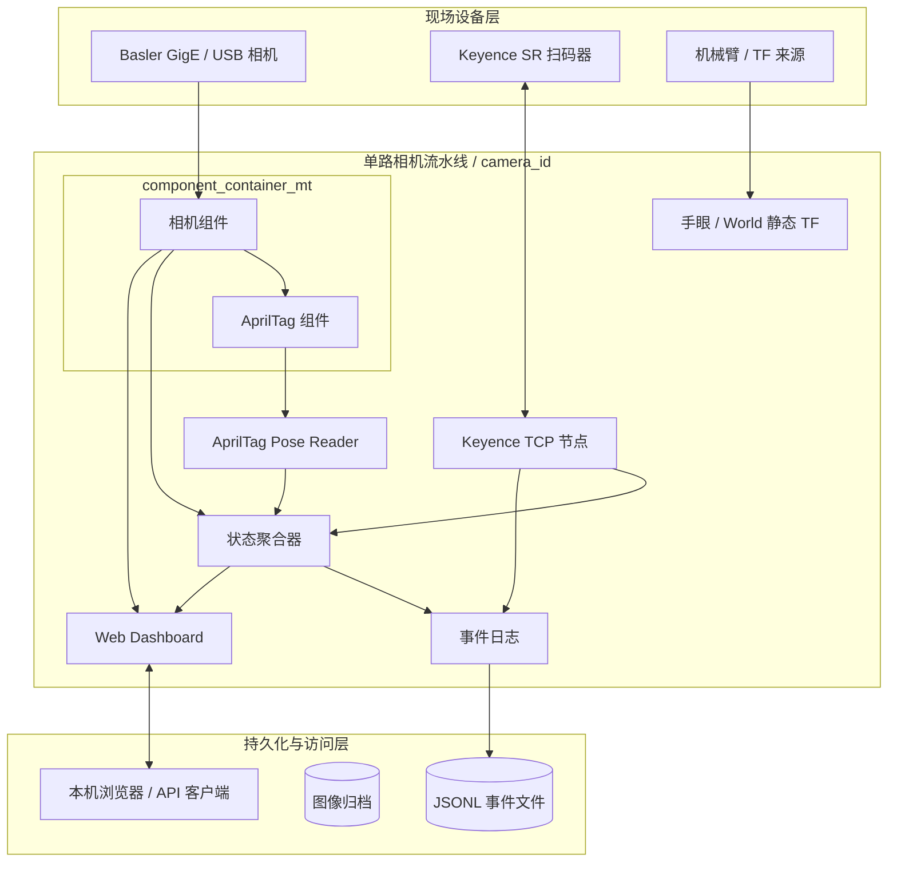

# ROS 2 工业视觉工作区

本项目是一套面向工业现场的 ROS 2 Humble 视觉流水线，统一集成 Basler 相机、AprilTag、Keyence SR 扫码器、标定、状态聚合、事件记录和 Web Dashboard。系统支持单相机运行与 Docker 部署。

## 项目背景

工业视觉系统通常不是单一算法节点，而是一条横跨设备接入、图像处理、空间标定、业务读码和现场运维的数据链。相机与扫码器使用不同协议，检测模块对图像格式和相机内参有不同要求，机械臂应用还需要维护稳定的 TF 关系。系统一旦部署到工控机，还必须能够回答“设备是否在线、数据是否新鲜、哪一环发生故障、事件能否追溯”等问题。

本项目将这些能力收敛到统一的 ROS 2 工作区和 launch 模型中，重点解决以下问题：

- 用一致的命名空间管理相机资源；
- 将高吞吐图像组件放在同一进程内，减少不必要的数据复制；
- 允许 AprilTag 和 Keyence 按现场需求独立启停；
- 将设备诊断、算法状态和扫码统计汇总为统一健康状态；
- 通过测试和容器化降低开发及现场交付成本；
- 将相机内参、手眼关系和静态 TF 纳入可重复的标定流程。

典型应用包括工件定位、机器人抓取前视觉引导、外置扫码器联动以及现场设备状态看板。

## 设计目标

| 目标 | 实现方式 |
|------|----------|
| 模块化 | 相机、AprilTag、Keyence、标定和可观测性由独立包负责 |
| 低复制 | 相机和 AprilTag 使用 composable node 与 intra-process 通信 |
| 命名空间隔离 | 流水线使用独立 `/{camera_id}` 命名空间 |
| 可降级 | 三类检测/扫码模块均可独立关闭，状态聚合器同步调整期望组件 |
| 可观测 | ROS 诊断、汇总状态、事件日志、健康检查和 Dashboard 形成完整链路 |
| 可复现 | colcon、pytest、CTest、CI 和 Docker 使用一致的构建测试入口 |
| 可维护 | 公共数学、TF、进程和 launch 逻辑集中在共享模块中 |

## 主要能力

- Basler GigE/USB 相机采集、参数控制、校正图像与诊断；
- AprilTag 检测、TF 查询和位姿发布；
- Keyence SR 扫码器 TCP 触发、读取和自动重连；
- 流水线健康聚合、JSON Lines 事件日志和图像归档；
- FastAPI Dashboard、HTTP API、WebSocket 和相机控制；
- AprilGrid 相机内参标定与 xArm eye-in-hand 手眼标定；
- 单相机运行模式。

## 技术基线

- Ubuntu 22.04；
- ROS 2 Humble；
- Python 3.10；
- C++17；
- OpenCV、cv_bridge、apriltag_ros；
- Basler pylon SDK，相机组件和生产镜像构建时需要。

## 系统架构

### 运行分层



硬件接入与高带宽算法位于组件容器中，设备协议和业务辅助能力以独立进程运行，可观测性节点则消费统一诊断和业务事件。

### 数据流

每个 `camera_id` 对应一条独立流水线，所有业务接口位于 `/{camera_id}` 命名空间下。

```mermaid
flowchart LR
  Camera[Basler Camera Component]
  AprilTag[AprilTag Component]
  Pose[Pose Reader]
  Keyence[Keyence Node]
  Diagnostics[/diagnostics]
  Status[/vision/status]
  Events[(events.jsonl)]
  Dashboard[Dashboard]

  Camera -->|image_rect + camera_info| AprilTag
  AprilTag -->|detections + TF| Pose
  Camera --> Diagnostics
  Pose --> Diagnostics
  Keyence -->|diagnostics| Diagnostics
  Diagnostics --> Status
  Keyence -->|barcode| Status
  Keyence --> Events
  Status --> Events
  Status --> Dashboard
```

生产入口为 `industrial_vision_bringup/vision_pipeline.launch.py`。相机和 AprilTag 运行在同一个多线程组件容器中，并启用 ROS 2 intra-process 通信；状态、日志和 Dashboard 等 Python 节点独立运行。

> AprilTag 使用 `image_rect`。Basler 驱动只有成功加载有效 `camera_info_url` 后才发布校正图像，因此生产环境必须配置可用的相机内参。

## 运行模式

| 模式 | 相机来源 | 适用场景 | 入口 |
|------|----------|----------|------|
| 本地单相机 | Basler 实机 | 调试相机、算法和标定 | `vision_pipeline.launch.py` |
| Docker 单相机 | Basler 实机 | 工控机生产部署 | `docker-compose.yml` |

## 快速开始

所有命令默认从工作区根目录执行：

```bash
cd /home/ubuntu/ros2_ws
source /opt/ros/humble/setup.bash
```

### 本地真实硬件

先安装 pylon SDK，并确认相机配置与实体设备匹配：

```bash
colcon build --symlink-install \
  --packages-up-to industrial_vision_bringup \
  --event-handlers console_direct+

source install/setup.bash
ros2 launch industrial_vision_bringup vision_pipeline.launch.py \
  camera_id:=my_camera \
  camera_config:="$PWD/deploy/basler_camera/config/aca2500_106611_18.yaml"
```

常用检查：

```bash
ros2 node list
ros2 topic echo /my_camera/vision/status --once
ros2 topic hz /my_camera/pylon_ros2_camera_node/image_raw
```

Dashboard 默认地址：<http://127.0.0.1:8080>

## Docker 部署

将有效的 Basler pylon SDK 安装包放入 `deploy/basler_camera/pylon-sdk/`，从工作区根目录构建：

```bash
DOCKER_BUILDKIT=1 docker build \
  -f deploy/basler_camera/Dockerfile \
  -t basler_camera_20260819_v2.0 .

cp deploy/basler_camera/.env.example deploy/basler_camera/.env
# 按现场设备修改 deploy/basler_camera/.env

docker compose --env-file deploy/basler_camera/.env \
  -f deploy/basler_camera/docker-compose.yml up -d
```

查看状态和执行业务健康检查：

```bash
docker compose --env-file deploy/basler_camera/.env \
  -f deploy/basler_camera/docker-compose.yml ps
docker logs --tail 200 basler_camera
docker exec basler_camera \
  /opt/ros2_ws/deploy/basler_camera/healthcheck.sh
```

容器使用 host 网络。Dashboard 当前仅监听 `127.0.0.1`，远程访问应通过带认证和访问控制的代理或隧道提供。

## 构建与测试

完整开发验证：

```bash
source /opt/ros/humble/setup.bash
colcon build --symlink-install \
  --packages-up-to industrial_vision_bringup
source install/setup.bash

export PYTEST_DISABLE_PLUGIN_AUTOLOAD=1
python3 -m pytest -q

colcon test --packages-select \
  pylon_ros2_camera_component \
  --return-code-on-test-failure
colcon test-result --verbose
```

没有 pylon SDK 时，不构建和测试 `pylon_ros2_camera_component`。提交前还可执行：

```bash
python3 -m pip install --user pre-commit
pre-commit run --all-files
git diff --check
```

## ROS 2 包

| 包 | 职责 |
|----|------|
| `industrial_vision_bringup` | 生产流水线装配 |
| `pylon_ros2_camera_interfaces` | 相机消息、服务和 Action 接口 |
| `pylon_ros2_camera_component` | Basler 相机 C++ 组件 |
| `pylon_ros2_camera_wrapper` | 独立相机进程和设备配置 |
| `apriltag_pose_reader_interfaces` | 标定 Action 和重载服务接口 |
| `apriltag_pose_reader` | AprilTag 位姿相关资源和兼容包 |
| `keyence_sr_wrapper` | Keyence SR TCP 通信 |
| `vision_core` | 数学、TF、诊断、进程和 launch 公共工具 |
| `vision_nodes` | 状态、事件和 ROS 数据层 |
| `vision_dashboard` | Dashboard、HTTP API 和 WebSocket |
| `aprilgrid_calibration` | AprilGrid 相机内参标定 |
| `handeye_calibration` | xArm 手眼标定和静态 TF |

## 目录结构

```text
ros2_ws/
├── src/                         # 12 个 ROS 2 功能包
├── deploy/basler_camera/        # Dockerfile、Compose、entrypoint 和健康检查
│   ├── config/                  # 运行时只读挂载的相机及标定配置
│   ├── data/events/             # JSON Lines 事件日志
│   └── pylon-sdk/               # 本地 SDK 构建输入，不应公开提交
├── current_docs/                # 当前实现的详细文档
├── scripts/                     # 工作区辅助脚本
├── pyproject.toml               # pytest 配置
└── .pre-commit-config.yaml      # Python、Shell、JavaScript 和 YAML 检查
```

`build/`、`install/` 和 `log/` 是 colcon 生成目录，不属于源码。遇到构建异常时可以清理后重建，但不要把其中内容当作配置源。

## 核心接口

以下名称以默认 `camera_id=my_camera` 为例：

| 接口 | 类型 | 用途 |
|------|------|------|
| `/my_camera/pylon_ros2_camera_node/image_raw` | `sensor_msgs/msg/Image` | 原始图像 |
| `/my_camera/pylon_ros2_camera_node/image_rect` | `sensor_msgs/msg/Image` | 校正图像，供 AprilTag 使用 |
| `/my_camera/pylon_ros2_camera_node/camera_info` | `sensor_msgs/msg/CameraInfo` | 相机内参 |
| `/my_camera/detections` | `apriltag_msgs/msg/AprilTagDetectionArray` | AprilTag 检测结果 |
| `/my_camera/apriltag/pose` | `geometry_msgs/msg/PoseStamped` | AprilTag 位姿 |
| `/my_camera/scanner/barcode` | `std_msgs/msg/String` | Keyence 扫码文本 |
| `/my_camera/scanner/trigger` | `std_srvs/srv/Trigger` | 主动触发扫码 |
| `/my_camera/diagnostics` | `diagnostic_msgs/msg/DiagnosticArray` | 组件诊断 |
| `/my_camera/vision/status` | `pylon_ros2_camera_interfaces/msg/VisionStatus` | 流水线汇总状态 |

完整 ROS、HTTP 和 WebSocket 接口见 [接口参考](current_docs/05-接口参考.md)。

## 配置模型

配置按职责分为三层：

1. 相机 YAML 保存设备选择、相机内参、曝光和采集参数，由 `camera_config` 指定。
2. ROS launch 参数控制模块开关、命名空间、扫码器连接、检测频率、TF 和 Dashboard。
3. Docker `.env` 将现场参数转换为 launch 参数。

显式 `name:=value` launch 参数优先于 launch 中读取的环境变量默认值。`params_file` 只追加给状态聚合器、事件日志和 Dashboard，不会自动覆盖相机、AprilTag 或 Keyence 节点。

常用功能开关：

```text
enable_apriltag / ENABLE_APRILTAG
enable_keyence / ENABLE_KEYENCE
enable_web_dashboard / ENABLE_WEB_DASHBOARD
```

## 健康与数据判定

系统使用 `VisionStatus.overall_level` 表达整条流水线状态：

| 值 | 名称 | 说明 |
|----|------|------|
| 0 | OK | 所有已启用组件均正常 |
| 1 | WARN | 至少一个组件处于警告状态 |
| 2 | ERROR | 组件错误或期望诊断缺失 |
| 3 | STALE | 状态已过期 |

Docker 健康检查会验证 `camera_info` 是否能收到、已启用节点是否存在、`vision/status` 是否可用，并在状态为 ERROR 或 STALE 时判定容器不健康。节点存在不代表系统可用，验收时应同时检查实际消息和业务状态。

## 系统边界

- 本仓库不分发 Basler pylon SDK；SDK 的获取、许可和版本适配由部署方负责。
- 手眼标定依赖可用的机器人状态与 AprilTag 变换，标定 Action server 不由生产流水线自动启动。
- `world_frame` 和 `base_frame` 同时设置时，当前流水线发布单位静态变换；真实不重合的坐标系必须使用现场外参。
- Dashboard 没有内置用户登录，仅监听 `127.0.0.1`；对外提供服务时必须增加认证和网络访问控制。
- 事件日志和图像归档可能包含业务数据，需按现场的数据保留与脱敏策略管理。

## 文档

当前实现的完整文档位于 [current_docs/](current_docs/README.md)：

- [系统架构](current_docs/01-系统架构.md)
- [开发与测试](current_docs/02-开发与测试.md)
- [运行与配置](current_docs/03-运行与配置.md)
- [Docker 部署](current_docs/04-Docker部署.md)
- [接口参考](current_docs/05-接口参考.md)
- [标定与 TF](current_docs/06-标定与TF.md)
- [运维与排障](current_docs/07-运维与排障.md)

## 运行约定

1. 每个终端先加载 `/opt/ros/humble/setup.bash`，构建后再加载 `install/setup.bash`。
2. `camera_id` 必须是合法 ROS 标识符。
3. 宿主机与容器的 `ROS_DOMAIN_ID`、RMW 实现和 DDS 网络策略必须兼容。
4. `deploy/basler_camera/config/` 是容器运行时只读挂载的现场配置来源。
5. `.env`、设备地址、序列号、SDK 安装包和业务扫码数据不应提交到公共仓库。