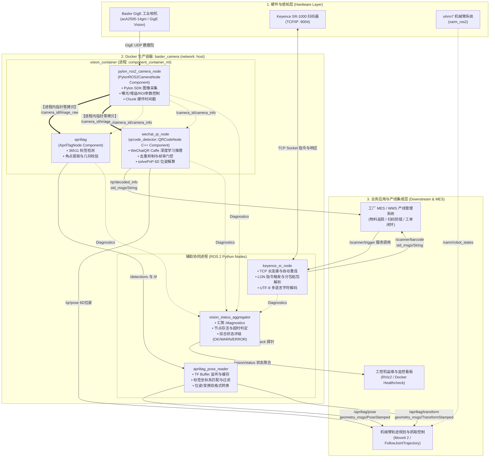
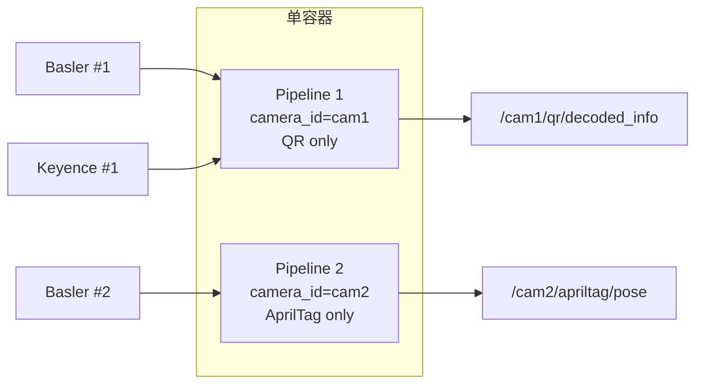

# ROS2 工业视觉工作区

基于 ROS 2 Humble 的工业视觉系统，集成 Basler GigE 相机、AprilTag 位姿检测、二维码识别和 Keyence 扫码器，支持单/双相机部署。

## 核心特性

- **统一容器部署**：单 Docker 容器运行全部检测链路，一键启动
- **模块化检测链**：AprilTag / QR / Keyence 可独立启用/禁用（`enable_apriltag` / `enable_qrcode` / `enable_keyence`）
- **多相机支持**：同一容器内运行两条独立 pipeline，每台相机可配不同检测链路，输出话题按 `camera_id` 命名空间隔离
- **相机与算法全链路组件化**：Basler 相机、AprilTag 检测与 WeChatQR 二维码节点均作为 C++ Component 运行在 `vision_container`（`component_container_mt`）中并启用 intra-process 零拷贝通信；Keyence 扫码与位姿处理作为独立进程运行
- **BEST_EFFORT QoS**：图像发布/订阅均使用 `BEST_EFFORT + depth=1`，丢弃旧帧而非阻塞采集循环
- **GenICam 读取节流**：`publishCurrentParams` 从每帧 30+ 次网络读取降至 1Hz；chunk mode 寄存器每帧 2 次读取改为 init 缓存
- **12-bit 零分配**：bit-shift 转换缓冲区复用为成员变量，消除每帧 ~10MB 堆分配
- **编码缓存**：`currentROSEncoding` init 时计算一次，服务回调时更新，消除每帧 GenICam 字符串读取
- **自动重连**：Keyence TCP 连接带定时重连 + `SO_KEEPALIVE` + `RLock` 线程安全保护
- **检测模块自动恢复**：AprilTag、二维码和 Keyence 节点配置 `respawn=True` + `respawn_delay=3.0`，崩溃后自动重启且防风暴
- **诊断集成**：Keyence / AprilTag 节点通过 `diagnostic_updater` 上报状态
- **资源限制**：Docker 容器配置 `mem_limit`/`cpus` + 日志轮转（`json-file 50m × 3`）
- **78 处空指针保护**：C++ 相机节点所有服务回调、detached action 线程均添加 null guard，防止相机重连期间段错误

## 目录结构

```
src/
├── pylon_ros2_camera_interfaces/   # 自定义消息/服务/动作定义
├── pylon_ros2_camera_component/    # Basler pylon 相机核心驱动 (C++)
├── pylon_ros2_camera_wrapper/      # 相机启动包装 + 配置/标定文件
├── industrial_vision_bringup/      # 统一 pipeline launch 入口
├── qrcode_detector/                # 二维码检测（WeChatQR + OpenCV fallback）
├── apriltag_pose_reader/           # AprilTag 位姿解算与转发
└── keyence_sr_wrapper/             # Keyence SR 扫码器 TCP 包装

deploy/
├── basler_camera/                  # 统一容器 Dockerfile + compose + healthcheck
└── DELIVERY_SUMMARY.md              # 统一容器交付摘要

scripts/                            # 部署、标定、RViz 脚本
项目启动运行指南/                    # 中文文档（SOP、故障排查、交接文档）
```

## 系统架构



### 多相机拓扑



## 环境要求

- Ubuntu 22.04 LTS (x86_64)
- ROS 2 Humble
- Basler pylon SDK 8.0.0
- OpenCV 4.5.4+ (`libopencv-dev`, `libopencv_wechat_qrcode`)
- Python 3.10 / NumPy 1.26.4
- Docker + Docker Compose（生产部署）

## 快速启动

### 方式一：Docker 一键启动（推荐，生产模式）

```bash
# 1. 配置环境变量
cp deploy/basler_camera/.env.example deploy/basler_camera/.env
# 编辑 .env，设置 CAMERA_ID、CAMERA_CONFIG_FILE 等
# 当前仓库中的 .env 将 ENABLE_QRCODE=false；需要验收二维码时请改为 true

# 2. 构建镜像（首次或代码变更后）
docker build -f deploy/basler_camera/Dockerfile -t basler_camera_20260819_v2.0 .

# 3. 启动
docker compose --env-file deploy/basler_camera/.env \
  -f deploy/basler_camera/docker-compose.yml up -d

# 4. 验证
docker logs basler_camera --tail 20
docker exec basler_camera /opt/ros2_ws/deploy/basler_camera/healthcheck.sh
```

### 方式二：双相机启动

编辑 `deploy/basler_camera/.env`：

```bash
# 相机 1：只跑 QR
CAMERA_ID=cam1
CAMERA_CONFIG_FILE=/opt/ros2_ws/deploy/basler_camera/config/cam1.yaml
ENABLE_QRCODE=true
ENABLE_APRILTAG=false
ENABLE_KEYENCE=false

# 相机 2：只跑 AprilTag
CAMERA_ID_2=cam2
CAMERA_CONFIG_2=/opt/ros2_ws/deploy/basler_camera/config/cam2.yaml
CAMERA_FRAME_2=basler_cam2
ENABLE_QRCODE_2=false
ENABLE_APRILTAG_2=true
ENABLE_KEYENCE_2=false
```

然后正常 `docker compose up -d`，entrypoint 会自动检测 `CAMERA_ID_2` 并启动第二条 pipeline。
双相机模式下，`CAMERA_CONFIG_2` 为必填项，且 `CAMERA_ID_2` 必须不同于
`CAMERA_ID`，`CAMERA_CONFIG_2` 必须不同于 `CAMERA_CONFIG_FILE`。
如果第二路启用 AprilTag，还必须设置与 `CAMERA_FRAME` 不同的 `CAMERA_FRAME_2`，避免 TF frame 冲突。
AprilTag child frame 同样按相机隔离，例如 `cam1/tag36h11:3` 与 `cam2/tag36h11:3`。

### 方式三：手动 launch（开发调试用）

```bash
cd /home/ubuntu/ros2_ws
source /opt/ros/humble/setup.bash
source install/setup.bash

# 全链路启动（单相机）
ros2 launch industrial_vision_bringup vision_pipeline.launch.py

# 自定义相机 ID + 只启用部分模块
ros2 launch industrial_vision_bringup vision_pipeline.launch.py \
  camera_id:=cam1 \
  enable_apriltag:=true \
  enable_qrcode:=false \
  enable_keyence:=false
```

### 验证链路

```bash
# 相机出图
ros2 topic hz /{camera_id}/pylon_ros2_camera_node/image_raw

# 检测结果
ros2 topic echo /{camera_id}/qr/decoded_info --once
ros2 topic echo /{camera_id}/apriltag/pose --once
ros2 topic echo /{camera_id}/scanner/barcode --once
```

## ROS 2 接口一览

| 话题 | 类型 | 说明 |
|------|------|------|
| `/{cam}/pylon_ros2_camera_node/image_raw` | `sensor_msgs/msg/Image` | 相机原始图像 |
| `/{cam}/pylon_ros2_camera_node/camera_info` | `sensor_msgs/msg/CameraInfo` | 相机内参 |
| `/{cam}/pylon_ros2_camera_node/status` | `ComponentStatus` | 相机状态 |
| `/{cam}/apriltag/pose` | `geometry_msgs/msg/PoseStamped` | AprilTag 位姿 |
| `/{cam}/apriltag/transform` | `geometry_msgs/msg/TransformStamped` | AprilTag 变换 |
| `/{cam}/qr/decoded_info` | `std_msgs/msg/String` | 二维码解码结果 |
| `/{cam}/scanner/barcode` | `std_msgs/msg/String` | Keyence 扫码结果 |
| `/{cam}/vision/status` | `pylon_ros2_camera_interfaces/msg/VisionStatus` | 单路视觉 pipeline 汇总状态和指标 |

| 服务 | 类型 | 说明 |
|------|------|------|
| `/{cam}/scanner/trigger` | `std_srvs/srv/Trigger` | 触发 Keyence 单次扫码 |

## 诊断与监控

节点通过 `/{camera_id}/diagnostics` 话题上报运行状态：

```bash
# 查看所有诊断信息
ros2 topic echo /my_camera/diagnostics --once

# 重点关注
# - "Scanner Connection": Keyence 连接状态 + 扫码/错误计数
# - "AprilTag Status": 检测计数 + 当前跟踪的标签帧
```

每路 pipeline 还发布 `/{camera_id}/vision/status`，汇总组件状态、错误信息和诊断 key/value 指标。组件诊断超过 5 秒没有更新时，该路状态为 `STALE`。

当前指标包括相机图像发布 FPS、QR 处理 FPS/耗时/跳过帧数、AprilTag TF 消息频率/处理耗时，以及 Keyence 请求次数/耗时/连续失败次数。

健康检查要求每路相机的 `/{CAMERA_ID}/pylon_ros2_camera_node/camera_info`
话题类型正确且消息可达；同时，每路 `ENABLE_*` 为 `true` 的模块节点必须存在。
禁用的模块不纳入健康检查。

统一 pipeline 启动时，`scanner_port`/`SCANNER_PORT` 必须是 $1$ 至 $65535$ 的整数，
`reconnect_interval_s`/`RECONNECT_INTERVAL_S` 必须是有限且不小于 $0$ 的数值。

## 文档入口

| 文档 | 路径 |
|------|------|
| 故障排查手册 | [故障排查手册](项目启动运行指南/故障排查手册.md) |
| 工控机集成与运维指南 | [工控机集成与运维指南](项目启动运行指南/工控机集成与运维指南.md) |
| 启动与运行 SOP | [快速启动指南](项目启动运行指南/快速启动指南.md) |
| 测试验收标准 | [部署与开发操作手册：ROS 2 运行验证与验收](项目启动运行指南/部署与开发操作手册.md#9-ros-2-运行验证与验收) |
| 交接保留运行要点 | [交接保留运行要点](项目启动运行指南/交接保留运行要点.md) |
| 模块交付摘要 | [模块交付摘要](deploy/DELIVERY_SUMMARY.md) |

## GitHub 仓库

- 个人仓库：`origin` -> https://github.com/jason889977/ros2_ws
- 组织仓库：`org` -> https://github.com/industrialnext-ai-dd/ros2_ws

```bash
git remote -v          # 查看远程
git push               # 推送到个人仓库
git push org main      # 同步到组织仓库
```

## 备注

- `build/`、`install/`、`log/` 已通过 `.gitignore` 忽略
- `main` 默认跟踪个人仓库 `origin/main`
- 统一容器模式为唯一生产路径，QR、AprilTag 和 Keyence 的独立容器配置已移除
