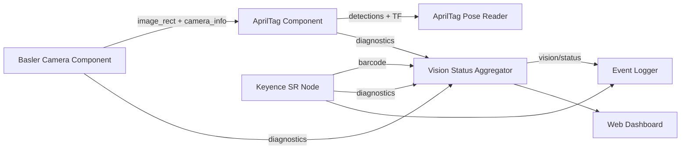

# 系统架构

## 1. 系统目标

该工作区实现一套 ROS 2 Humble 工业视觉流水线，统一接入：

- Basler GigE/USB 相机采集与控制；
- AprilTag 检测、TF 查询与位姿发布；
- Keyence SR 扫码器 TCP 通信；
- 状态聚合、事件持久化和 Web Dashboard；
- AprilGrid 相机内参标定与 xArm 手眼标定。

## 2. 包清单

| 包                                 | 构建类型         | 当前职责                                        |
| --------------------------------- | ------------ | ------------------------------------------- |
| `pylon_ros2_camera_interfaces`    | CMake/rosidl | 相机消息、服务和 Action 接口                          |
| `pylon_ros2_camera_component`     | CMake/C++    | Basler 相机组件、设备控制、图像与诊断发布                    |
| `pylon_ros2_camera_wrapper`       | CMake/C++    | 相机组件的独立进程包装器与相机配置                           |
| `apriltag_pose_reader_interfaces` | CMake/rosidl | 相机标定、手眼标定 Action 与重载服务                      |
| `apriltag_pose_reader`            | Python       | AprilTag 相关兼容包与配置资源                         |
| `keyence_sr_wrapper`              | Python       | Keyence SR TCP 连接、触发和重连                     |
| `vision_core`                     | Python       | 共享数学、TF、诊断、进程和 launch 工具                    |
| `vision_nodes`                    | Python       | 状态聚合、事件日志、位姿读取及 Dashboard ROS 数据层      |
| `vision_dashboard`                | Python       | FastAPI/uvicorn 启动、HTTP API、WebSocket 和静态前端 |
| `industrial_vision_bringup`       | Python       | 统一流水线和节点装配                            |
| `aprilgrid_calibration`           | Python       | AprilGrid 棋盘规格、图像检测与内参标定 Action             |
| `handeye_calibration`             | Python       | 手眼求解离线 CLI、静态 TF 广播器与热重载服务            |

## 3. 生产流水线

每个 `camera_id` 对应一条独立流水线：

相机和 AprilTag 组件装入 `component_container_mt`，并为各组件启用 `use_intra_process_comms`。Python 辅助节点作为独立进程运行。

AprilTag 消费相机的 `image_rect`。Basler 组件只有在 `camera_info_url` 成功加载有效标定后才初始化校正发布器，因此生产环境必须提供可加载的相机内参。

## 4. 命名空间模型

所有流水线级主题使用 `/{camera_id}` 前缀。默认 `camera_id` 为 `my_camera`。

核心名称由 `build_namespaced_topics()` 统一生成：

- 相机：`/{camera_id}/pylon_ros2_camera_node/*`
- AprilTag：`/{camera_id}/detections`、`/{camera_id}/apriltag/*`
- Keyence：`/{camera_id}/scanner/*`
- 诊断：`/{camera_id}/diagnostics`
- 汇总状态：`/{camera_id}/vision/status`

`camera_id` 必须匹配 ROS 标识符规则 `[A-Za-z][A-Za-z0-9_]*`。

## 5. 单相机模型

统一 launch 每次构造一条流水线，系统仅支持单台 Basler 相机。Docker entrypoint 以单路模式启动统一 launch，并传入 `.env` 转换后的相机与业务参数。

单相机约束：

- 每个 `camera_id` 唯一对应一条流水线，所有节点与话题位于 `/{camera_id}` 命名空间下；
- `camera_id` 必须匹配 ROS 标识符规则 `[A-Za-z][A-Za-z0-9_]*`；
- `camera_config` 指向唯一一份相机 YAML，`camera_frame` 与 TF frame 全局唯一。

## 6. 可观测性

流水线始终启动 `vision_status_aggregator` 和 `event_logger`；`web_dashboard` 由 `enable_web_dashboard` 控制：

- `vision_status_aggregator`：聚合期望组件的诊断状态，并记录 Keyence 扫码计数；
- `event_logger`：将状态变化和扫码事件写入 JSON Lines；
- `web_dashboard`：由 `enable_web_dashboard` 控制，提供状态、图像和控制 API。

`VisionStatus.overall_level` 定义为：

| 值 | 名称    | 含义          |
| - | ----- | ----------- |
| 0 | OK    | 期望组件均正常     |
| 1 | WARN  | 至少一个组件警告    |
| 2 | ERROR | 组件错误或期望诊断缺失 |
| 3 | STALE | 状态过期        |

## 7. TF 与标定接入

- AprilTag 检测组件发布标签 TF，`apriltag_pose_reader` 从 TF buffer 查询并发布 Pose/TransformStamped。
- 设置 `handeye_calibration_file` 时，流水线启动静态 TF 节点，从 OpenCV YAML 发布机械臂末端到相机的变换。
- 同时设置 `world_frame` 和 `base_frame` 时，流水线额外发布单位变换 `world → base`，用于提供全局锚点；真实外参需由现场配置替换。

