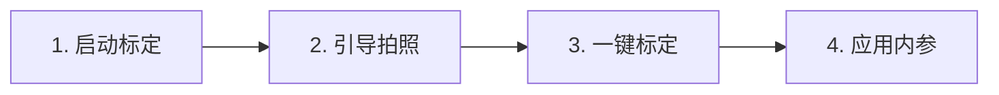
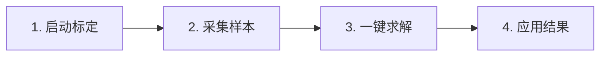

# 标定与 TF

## 1. 标定组件

当前代码提供两条独立流程：

- AprilGrid 相机内参标定：**只能通过 Web Dashboard 四步向导进行**（见第 2 节）；
- xArm eye-in-hand 手眼标定：通过 Web Dashboard 四步向导录入手动位姿采集与求解（见第 4 节）。

统一生产流水线负责加载结果和发布静态 TF。

## 2. AprilGrid 内参标定

**内参标定只能通过 Web Dashboard 的四步向导进行**，不支持独立 CLI 或手动启动 Action server 的方式。Dashboard 会自动管理标定服务的启动、采集会话和结果应用。

### 步骤概览



### 步骤 1：启动标定

打开 Dashboard `http://127.0.0.1:8080`，进入"相机内参标定"页面，点击"启动标定"按钮。Dashboard 会自动启动标定 Action server 并创建新的采集会话。

HTTP 接口：

```bash
curl -X POST http://127.0.0.1:8080/api/calibration/service/toggle   # 启动/停止标定服务
curl -X POST http://127.0.0.1:8080/api/calibration/session           # 创建新采集会话
```

### 步骤 2：引导拍照

页面会显示 AprilGrid 检测预览和覆盖度热力图，提示当前板卡在画面中的位置、尺寸、倾斜是否合适。用户按引导调整板卡姿态，覆盖画面中心、四边、四角、远近和倾角，每调整一次点击"采集"按钮。建议采集 12 至 20 张，每张至少检测到半数以上标签。

HTTP 接口：

```bash
curl -X POST http://127.0.0.1:8080/api/calibration/captures           # 采集一张
curl       http://127.0.0.1:8080/api/calibration                       # 查询会话状态
curl       http://127.0.0.1:8080/api/calibration/preview               # 获取检测叠加预览
```

### 步骤 3：一键标定

采集完成后点击"一键标定"，Dashboard 提交 `/calibrate_camera` Action，实时反馈检测进度和重投影误差。标定成功后页面显示内参矩阵、畸变系数、RMS 和去畸变预览图。

HTTP 接口：

```bash
curl -X POST http://127.0.0.1:8080/api/calibration/start \
  -H 'Content-Type: application/json' \
  -d '{"rows": 4, "cols": 3, "tag_size_m": 0.05, "tag_spacing_m": 0.01, "tag_family": "tag36h11", "max_reprojection_error": 2.0, "timeout_s": 300}'
curl -X POST http://127.0.0.1:8080/api/calibration/cancel             # 取消
```

### 步骤 4：应用内参

标定成功后点击"应用内参"，Dashboard 将结果 YAML 写入相机配置引用的 `camera_info_url` 路径，并校验文件有效性。无需手动复制文件或重新构建。

HTTP 接口：

```bash
curl -X POST http://127.0.0.1:8080/api/calibration/apply \
  -H 'Content-Type: application/json' \
  -d '{"filename": "calibration_20260902_153000.yaml"}'
```

应用后验证：

```bash
ros2 topic echo /my_camera/pylon_ros2_camera_node/camera_info --once
```

必须检查 `k[0]`、`k[4]` 等焦距值是实际标定结果，而不是占位值。`image_rect` 话题应开始持续发布校正图像。

### 板卡规格

当前仅支持以下 AprilGrid：

| 项目 | 值 |
| --- | --- |
| 标签族 | `tag36h11` |
| 行数 × 列数 | `4 × 3` |
| 标签数量 | `12` |

`tag_size_m` 和 `tag_spacing_m` 必须与实体标定板实测值一致，不能使用设计文件标称值。

### 离线 CLI/Action 参考（调试用）

以下方式仅用于调试或自动化脚本，**不是生产推荐路径**。生产标定请使用 Web 四步向导。

```bash
# 手动启动标定 Action server（Dashboard 也会自动启动）
ros2 run aprilgrid_calibration aprilgrid_calibration_server

# 发送 Action 目标
ros2 action send_goal --feedback \
  /calibrate_camera \
  apriltag_pose_reader_interfaces/action/CalibrateCamera \
  "{input_dir: '/data/calibration/input', \
    output_dir: '/data/calibration/output', \
    rows: 4, cols: 3, \
    tag_size_m: 0.05, tag_spacing_m: 0.01, \
    tag_family: 'tag36h11', \
    output_name: 'camera_calibration.yaml', \
    max_reprojection_error: 2.0, timeout_s: 300.0}"
```

服务行为：

1. 将输入目录的图片收集到输出目录；
2. 检测 AprilGrid；
3. 运行 OpenCV 相机标定；
4. 可选地按最大重投影误差拒绝结果；
5. 输出 3x3 内参、5 个畸变参数、图像尺寸和 YAML 路径。

## 3. 应用相机内参（手动方式）

> 生产环境请使用 Dashboard 四步向导的"应用内参"按钮，自动完成本节操作。

手动流程：将标定结果 YAML 复制到相机配置引用的位置，并确认相机 YAML 的 `camera_info_url` 指向有效文件。当前容器配置目录：

```text
deploy/basler_camera/config/
```

Web 标定页面默认保存到 `calibration_dir`；Docker 默认目录为 `/var/lib/vision/calibration`，并映射到宿主机 `deploy/basler_camera/data/calibration/`。

重启流水线后验证：

```bash
ros2 topic echo \
  /my_camera/pylon_ros2_camera_node/camera_info --once
```

## 4. 手眼标定 Web 向导

前置条件：

- 已构建 `apriltag_pose_reader_interfaces`；
- AprilTag 变换话题 `/apriltag/transform` 发布 `geometry_msgs/msg/TransformStamped`（流水线 `enable_apriltag:=true`）；
- 启动流水线时通过 `handeye_calibration_file` 参数指定输出 YAML 路径。

手眼标定完全在 Web Dashboard 中完成，无需独立启动 Action server。打开 `http://127.0.0.1:8080`，进入"手眼标定"页面。

### 步骤概览



### 步骤 1：启动标定

点击"启动标定"按钮，Dashboard 创建新的采集会话。

HTTP 接口：

```bash
curl -X POST http://127.0.0.1:8080/api/handeye/session
```

### 步骤 2：采集样本

将 AprilGrid 标定板放在相机视野内，确认页面显示"标签位姿就绪"。在位姿表单中输入当前机械臂位姿（X/Y/Z 单位 mm，Roll/Pitch/Yaw 单位 °），点击"采集样本"。Dashboard 自动抓取当前画面并记录对应的 AprilTag 变换矩阵和手动输入的位姿。

重复至少 4 次（建议 10-20 组），每次移动后确保位姿变化满足运动多样性阈值（平移 ≥ 1mm、旋转 ≥ 1°），否则 Dashboard 会拒绝采集。

HTTP 接口：

```bash
curl -X POST http://127.0.0.1:8080/api/handeye/samples \
  -H 'Content-Type: application/json' \
  -d '{"x_mm": 300, "y_mm": 0, "z_mm": 400, "roll_deg": 0, "pitch_deg": 0, "yaw_deg": 0}'
curl       http://127.0.0.1:8080/api/handeye          # 查询会话状态与样本列表
curl       http://127.0.0.1:8080/api/handeye/preview   # 带 AprilTag 检测叠加预览
```

### 步骤 3：一键求解

采集完成后点击"一键求解"，Dashboard 在后台线程调用 `vision_core.solve_hand_eye` 求解 AX=XB，计算闭环误差，写入 YAML。

HTTP 接口：

```bash
curl -X POST http://127.0.0.1:8080/api/handeye/start \
  -H 'Content-Type: application/json' \
  -d '{"algorithm": "tsai", "max_closed_loop_translation_m": 0.001, "max_closed_loop_rotation_deg": 0.5}'
```

支持算法：`tsai`、`park`、`horaud`、`daniilidis`。至少需要 4 个样本；生产标定应采集覆盖多方向平移和旋转的样本，并设置可接受的闭环误差阈值。

### 步骤 4：应用结果

求解成功后点击"应用结果"，Dashboard 将 YAML 复制到 `handeye_calibration_file` 指定路径，并调用静态 TF 广播器的 `ReloadCalibration` 服务热重载变换。

HTTP 接口：

```bash
curl -X POST http://127.0.0.1:8080/api/handeye/apply \
  -H 'Content-Type: application/json' \
  -d '{"id": "20260903T120000-ab12cd"}'
```

## 5. 离线手眼求解入口

包还提供离线 CLI：

```bash
ros2 run handeye_calibration handeye_calibrate --help
```

该 CLI 从 CSV 位姿数据集求解手眼变换，适合对 Web 会话导出的 CSV 重新求解。具体参数以 `--help` 输出为准。

## 6. 加载手眼结果

统一流水线可通过 launch 参数加载：

```bash
ros2 launch industrial_vision_bringup vision_pipeline.launch.py \
  handeye_calibration_file:=/data/calibration/handeye.yaml \
  camera_frame:=my_camera_optical_frame
```

静态 TF 读取规则：

1. 优先读取 `gripper_to_camera_matrix`；
2. 若只有 `camera_to_gripper_matrix`，检查矩阵可逆后求逆；
3. YAML 中可提供 `gripper_frame` 和 `camera_frame`；
4. 缺省 parent 为 `tool0`，缺省 child 为 launch 传入的相机 frame。

手动启动静态发布器：

```bash
ros2 run handeye_calibration handeye_static_tf_broadcaster --ros-args \
  -p calibration_file:=/data/calibration/handeye.yaml \
  -p child_frame:=my_camera_optical_frame
```

## 7. 热重载静态标定

静态发布器提供私有服务 `~/reload_calibration`。示例：

```bash
ros2 service call \
  /my_camera/handeye_static_tf_broadcaster/reload_calibration \
  apriltag_pose_reader_interfaces/srv/ReloadCalibration \
  "{calibration_file: '/data/calibration/handeye.yaml'}"
```

调用成功后重新发布静态变换。文件必须是 OpenCV FileStorage 可读取的 4x4 有限矩阵。

## 8. World 到 Base 锚点

同时提供：

```bash
ros2 launch industrial_vision_bringup vision_pipeline.launch.py \
  world_frame:=world base_frame:=base_link
```

当前实现发布零平移、零旋转的单位变换。只有当两个坐标系确实重合时才应直接使用；否则应由实际外参来源发布正确变换，避免形成错误 TF 树。

## 9. 验证 TF

```bash
ros2 run tf2_ros tf2_echo tool0 my_camera_optical_frame
ros2 run tf2_ros tf2_echo my_camera_optical_frame my_camera/tag36h11:0
ros2 topic echo /tf_static --once
```

验收时同时检查：坐标系方向、单位、四元数归一化、平移数量级和时间戳。
