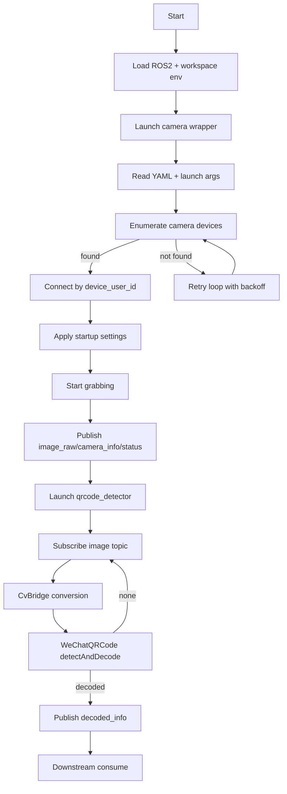
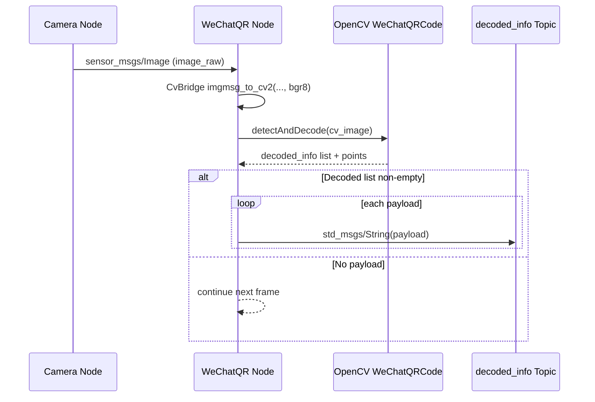

# 03 - Core Flow and Algorithm

## 1. End-to-End Core Flow

## 2. Camera Connection and Recovery Logic

- The component attempts to create camera instance with device_user_id.
- If unavailable, it logs warning and retries until device appears.
- Once connected, it applies startup profile and begins publish loop.

## 3. QR Algorithm Path

## 4. Model Loading Strategy

- Primary: load 4 model files from package models directory.
- Fallback: if files missing, instantiate OpenCV default WeChatQRCode path.
- Recommendation: keep explicit model files for deterministic behavior.

## 5. Performance and Stability Considerations

- Large frame sizes increase bus load and jitter.
- topic hz jitter may appear with heavy payloads; cross-check using topic bw and camera_info cadence.
- For GigE tuning, combine ROI reduction, exposure strategy, and MTU optimization.

Known field issue:
- repeated `3774873620` (buffer incompletely grabbed) can occur under constrained network path; treat as release-blocking until mitigated.

## 6. Evidence References

- QR detect-and-decode implementation and publish path:
  [src/qrcode_detector/qrcode_detector/qrcode_node.py](../src/qrcode_detector/qrcode_detector/qrcode_node.py#L60)
- Camera launch tunables (`mtu_size`, `config_file`):
  [src/pylon_ros2_camera_wrapper/launch/pylon_ros2_camera.launch.py](../src/pylon_ros2_camera_wrapper/launch/pylon_ros2_camera.launch.py#L26)
- GigE tuning notes (`mtu_size`, `inter_pkg_delay`) in default profile:
  [src/pylon_ros2_camera_wrapper/config/default.yaml](../src/pylon_ros2_camera_wrapper/config/default.yaml#L112)
